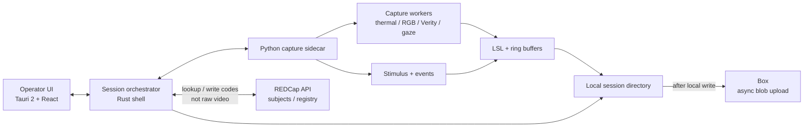

# Architecture: quantum-platform

| Field | Value |
|-------|--------|
| Document | `docs/ARCHITECTURE.md` |
| Status | **Decision locked** |
| Date | 2026-09-23 |
| Related | [DESIGN.md](DESIGN.md), [PLAN.md](PLAN.md), [HARDWARE.md](HARDWARE.md), [PROTOCOL.md](PROTOCOL.md), [INTEGRATIONS.md](INTEGRATIONS.md), [EXPERIMENT_CONFIG.md](EXPERIMENT_CONFIG.md) |

This document records the **desktop shell** decision and the alternatives that were compared. Capture modalities, sync, session layout, and event names stay in [DESIGN.md](DESIGN.md). Trial flow stays in [PROTOCOL.md](PROTOCOL.md). Machine-readable stages, collect flags, and operator reminders: [EXPERIMENT_CONFIG.md](EXPERIMENT_CONFIG.md). Sidecar IPC, packaging, REDCap fields, and Box paths: [INTEGRATIONS.md](INTEGRATIONS.md).

---

## 1. Status / decision summary

**Chosen shell: Option A — Tauri 2 + React + Rust shell + Python capture sidecar.**

Locked in September 2026. Same shape as [kelvinlim/audio-compare](https://github.com/kelvinlim/audio-compare): Tauri 2, React operator UI, a small Rust host, and a **bundled sidecar** for work that should not live in the UI process.

Options B–E remain documented below so the trade-off is recoverable. They are **not** the implementation path.

No software is implemented in this decision record. Phase 1 scaffolding in [PLAN.md](PLAN.md) should assume this shell.

---

## 2. Goals and constraints

Build a **local-first** operator desktop app for a seated painting-viewing protocol. One operator runs a session; the machine writes complete recordings to disk before anything leaves the lab.

### Capture (MVP)

| Stream | Device / method |
|--------|-----------------|
| Facial IR / perfusion | Owned **Optris PI 450i** |
| Facial RGB / expression / iris | Recommended **Teledyne FLIR Blackfly S** (Spinnaker / PySpin) |
| Heart rate / PPG | **Polar Verity Sense** (upper-arm BLE) |
| Gaze on the painting plane | Budget software gaze from face RGB (MediaPipe / OpenFace + geometry) |
| Events / stimulus | Software controller driven by experiment config (fixation → exposure → ISI, NUC policy) — [EXPERIMENT_CONFIG.md](EXPERIMENT_CONFIG.md) |

### Study operations

| Concern | Constraint |
|---------|------------|
| Subjects / registry | **REDCap** holds participant codes, eligibility, consent status, and study metadata — **not** raw video or thermal blobs |
| File storage | **Box** receives session blobs **after** a successful local write (async upload) |
| Recording | Local-first: a session is complete on disk even if Box or REDCap is unreachable |
| Protocol | Seated, fixed / locked chair; see [PROTOCOL.md](PROTOCOL.md) and [HARDWARE.md](HARDWARE.md) |
| Identifiable media | Face RGB and thermal stay on the capture host until an approved upload; do not stream off-lab without protocol approval ([DESIGN.md](DESIGN.md) §8) |

### Non-goals for the shell

- Replacing LSL + per-worker timestamps with a new sync fabric
- Putting raw video in REDCap
- Requiring network during recording
- Tobii-grade gaze or ECG-quality R-peaks (unchanged from DESIGN.md)

---

## 3. Recommended architecture



**Control plane:** Operator UI ↔ Rust session orchestrator ↔ Python sidecar (workers, stimulus, events).

**Data plane:** workers timestamp on arrival, publish on LSL, and write the session directory. The orchestrator creates the directory, records metadata, and **later** uploads blobs to Box.

**Registry plane:** orchestrator talks to REDCap for subject codes and session registry fields only.

```
sessions/<participant_id>/<session_id>/     ← local write is source of truth
  meta.yaml
  events.jsonl
  calibration/
  streams/{thermal,rgb,verity,gaze}/
  derived/                                  ← optional
        │
        └── async Box upload (same relative tree; see INTEGRATIONS.md)
```

---

## 4. Component responsibilities

### 4.1 Tauri 2 + React operator UI

- Session arm / stop, participant code entry, calibration wizards, device status.
- **Guided runbook** driven by the loaded experiment config ([EXPERIMENT_CONFIG.md](EXPERIMENT_CONFIG.md)): current stage, countdown, reminders, constraint badges, checklist gates. Not a hard-coded trial loop.
- Live previews and QC indicators (dropouts, BLE state, NUC-safe window).
- Operator checklist surfaces (NUC never during exposure).
- No direct USB/BLE/SDK calls. Talks to the Rust shell via Tauri IPC.

### 4.2 Rust shell (session orchestrator)

- Window, app lifecycle, and OS integration (same role as audio-compare’s `src-tauri`).
- Spawn, supervise, and shut down the Python sidecar (Tauri `externalBin` / sidecar pattern).
- Relay commands and events between the UI and the sidecar.
- Create the local session directory; enforce study-code filenames.
- REDCap HTTP client for registry fields.
- Queue **async Box upload** after local write + checksum; retry when the network returns.
- Must not be the capture hot path (no 80 Hz thermal or 120 Hz RGB in Rust for MVP).

### 4.3 Python capture sidecar

Long-lived process bundled with the app (dev: interpreter; release: **PyInstaller onedir** as Tauri `externalBin` — [INTEGRATIONS.md](INTEGRATIONS.md) §3).

| Worker | Responsibility |
|--------|----------------|
| `thermal` | Optris OTC / `libirimager`; raw frames + °C; manual NUC only when the controller allows |
| `rgb` | Spinnaker / PySpin; monotonic timestamps on arrival |
| `verity` | Polar BLE GATT; hardware + receive timestamps |
| `gaze` | MediaPipe (or OpenFace) on RGB; painting-plane intersection; `GazePainting` LSL |
| `stimulus` | Executes stages from the experiment config ([EXPERIMENT_CONFIG.md](EXPERIMENT_CONFIG.md)); event markers; “no NUC during stimulus” |

Sidecar isolation: a worker or interpreter fault can be restarted without tearing down the operator window.

### 4.4 LSL and clocks

Unchanged from [DESIGN.md](DESIGN.md) §4:

- Shared monotonic clock; timestamp on arrival in the capture thread.
- Do not frame-lock cameras of different rates.
- Pair RGB↔thermal by nearest timestamp.
- Prefer **pylsl / LSL** for multimodal transport.

### 4.5 Session layout

Same tree as DESIGN.md §5. The shell owns **creating** the directory; the sidecar owns **writing** streams, `events.jsonl`, and calibration artifacts.

---

## 5. REDCap and Box

### REDCap — subjects and registry, not raw video

REDCap is the study registry:

- Participant codes, eligibility, consent flags, visit / session rows.
- Optional ratings or CRF fields if the investigator enables them.
- Links (`participant_id`, `session_id`) that point at the Box path — not the bytes.

The app-facing field dictionary (`participants` + repeating `sessions`) is locked in [INTEGRATIONS.md](INTEGRATIONS.md) §4.

Do **not** PUT RGB, thermal, or other blobs into REDCap. File fields there do not replace the session directory.

### Box — blobs after local write

Box is durable object storage for completed sessions:

1. Write locally (`meta.yaml`, `events.jsonl`, streams, calibration).
2. Verify integrity (checksums in a later hardening phase).
3. Upload asynchronously, mirroring `sessions/<participant_id>/<session_id>/` under the Box study root ([INTEGRATIONS.md](INTEGRATIONS.md) §5).
4. Recording continues or completes even if upload is deferred.

Local disk remains the source of truth until upload is confirmed.

---

## 6. Alternatives considered

All five options were compared. **A is chosen.** B–E are retained so a later revisit has the original pros/cons.

### A — Tauri 2 + React + Rust shell + Python sidecar (**chosen**)

Same pattern as audio-compare: webview UI, thin Rust host, bundled sidecar. Here the sidecar is Python capture (cameras, BLE, MediaPipe, LSL) instead of ffmpeg.

**Pros**

- Reuses a known Kelvin stack (Tauri 2, React, Rust, `externalBin` sidecar).
- Python SDKs stay first-class: Optris, PySpin, Polar BLE, MediaPipe, pylsl.
- Sidecar crash/restart is isolated from the operator window.
- Small Rust surface: lifecycle, IPC, session dir, REDCap, Box — not frame loops.
- Lighter than Electron while still shipping a real desktop window.

**Cons**

- Two runtimes to package, sign, and debug (Rust host + Python sidecar).
- IPC and process supervision are extra moving parts vs a single Python GUI.
- Two artifacts to ship: Rust host plus a PyInstaller onedir sidecar (vendor SDKs may still need a host install).

**Best when**

The team already has a Tauri 2 + sidecar app, capture depends on Python SDKs, and the operator needs a local desktop window. **This project.**

### B — Tauri Rust-heavy, minimal Python

Tauri 2 + React UI, but thermal / RGB / BLE / gaze implemented in Rust (or C bindings). Python only where a library has no other path.

**Pros**

- One primary native runtime; potentially lower per-frame overhead.
- Fewer packaged interpreters; simpler release story if Python disappears.
- Stronger static typing on the hot path.

**Cons**

- Rewrites work that already exists as Python SDKs (PySpin, Optris OTC/gRPC wrappers, pylsl, MediaPipe, Polar BLE stacks).
- Longer path to a dry-run session; Phase 1 would stall on bindings.
- Gaze/AU work is Python-first; “minimal Python” tends to grow back.

**Best when**

The team is Rust-native **and** every device has a maintained C/Rust SDK. Not true for this MVP.

### C — Qt / PySide single process

One Python process: PySide/Qt widgets + the same capture workers.

**Pros**

- One language; no Tauri/Node toolchain.
- No IPC for start/stop if workers are in-process threads.
- Qt is mature for instrument-style desktop UIs.

**Cons**

- Does not reuse audio-compare (React/Tauri) skill or repo shape.
- UI + capture share one interpreter: a worker fault can take down the session window (GIL and native-extension crashes).
- Packaging/signing a PySide app is a different, less-practiced path for this team.
- Harder to keep a modern operator UI (live status, checklists) without rebuilding widgets.

**Best when**

The team is Qt-first and wants a single process with no webview. Not this team’s existing shell.

### D — Electron + Python sidecar

Chromium + Node host, Python sidecar for capture. Same split as A, heavier shell.

**Pros**

- Familiar web stack; huge Electron ecosystem.
- Sidecar isolation still available.
- Easy to find examples of “desktop UI + Python backend.”

**Cons**

- Ships Chromium: RAM/CPU contention with 80 Hz thermal + 60–120 Hz RGB on a lab workstation.
- Larger installers; worse default security/size story than Tauri 2.
- Diverges from audio-compare for no capture benefit (the sidecar is the same).

**Best when**

The product already is Electron or needs Chromium-only web APIs. Not required here.

### E — Headless Python + browser UI

Python process owns devices and a local HTTP/WebSocket API. Operator uses a normal browser tab.

**Pros**

- Fastest UI iteration (no desktop packaging to try a button).
- Possible remote observation from another machine on the LAN (if ever wanted).
- Capture code can start as a CLI (`qp doctor`, `qp session`) with a thin web front.

**Cons**

- Not a lab “app”: sidecar lifecycle, focus, and full-screen operator flow are awkward in a random tab.
- Browser sandbox vs USB/BLE/local disk is the wrong default for a capture host.
- Easy to accidentally treat the UI as networked; fights local-first and “do not stream identifiable video off-lab.”
- Two-machine confusion (which browser is the operator?).

**Best when**

A later **observer** dashboard, not the capture host itself.

---

## 7. Why A wins for this project

1. **Reuse audio-compare.** Tauri 2 + React + Rust + bundled sidecar is already a Kelvin pattern (`externalBin`, process spawn, desktop packaging). Option A copies that shape; only the sidecar payload changes (Python capture instead of ffmpeg).
2. **Python SDKs are the capture path.** Optris, Spinnaker/PySpin, Polar BLE, MediaPipe, and pylsl are Python-first. Option B pays a bindings tax before the first dry-run. Option C keeps Python but throws away the known UI shell.
3. **Sidecar isolation.** Cameras, BLE, and MediaPipe are the unstable surface. A sidecar can be restarted; the operator window and session metadata stay up. Single-process C (Qt) does not give that.
4. **Right weight for a lab host.** Tauri’s webview is enough for checklists and previews without Electron’s Chromium tax (D) or a loose browser tab (E).
5. **Clear split for REDCap and Box.** Rust (or the sidecar) can do HTTPS registry and async upload without putting those concerns inside a frame grabber.

Phase 1 should scaffold this split, not a Python-only CLI that would have to be rewritten into a desktop shell later.

---

## 8. Locked follow-ups

These do not reopen the A vs B–E decision. Locked 23 September 2026. Full contracts: [INTEGRATIONS.md](INTEGRATIONS.md).

| Topic | Decision | Pointer |
|-------|----------|---------|
| **Sidecar IPC** | JSON-RPC 2.0, newline-delimited JSON on the Python sidecar stdin/stdout | Methods: `session.start`, `session.stop`, `doctor.run`, `calibrate.gaze`, `status.get`. Notifications: `event.emit`, `device.status`, `error`. gRPC not chosen for MVP. [INTEGRATIONS.md](INTEGRATIONS.md) §2 |
| **Python packaging** | Dev: Python 3.11+ venv (or uv) + editable install (`python -m quantum_platform` / `qp`). Release: **PyInstaller onedir** as Tauri `externalBin` | Prefer onedir over onefile. PyOxidizer / conda-pack are fallbacks only. Vendor SDKs (Spinnaker, Optris) may still need host installers. [INTEGRATIONS.md](INTEGRATIONS.md) §3 |
| **REDCap project fields** | App contract: `participants` (classic) + `sessions` (repeating) | `record_id` is `participant_id`. No RGB/thermal file fields. Ratings CRFs optional later. [INTEGRATIONS.md](INTEGRATIONS.md) §4 |
| **Box folder taxonomy** | Mirror local `sessions/<participant_id>/<session_id>/` under a study root | Upload after local write. Multi-site prefixes deferred. Config: `box.root_folder_id`. [INTEGRATIONS.md](INTEGRATIONS.md) §5 |

Investigator protocol items (quantum vs standard definition, catalog, timing) remain in [PROTOCOL.md](PROTOCOL.md) §13 and are independent of the shell.

Experiment stage files, operator reminders, and collect flags are specified in [EXPERIMENT_CONFIG.md](EXPERIMENT_CONFIG.md). That sketch does not reopen Option A or the locks in this table.
