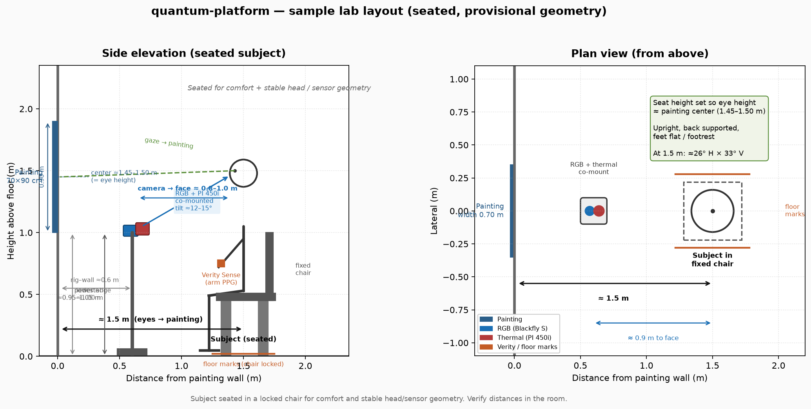
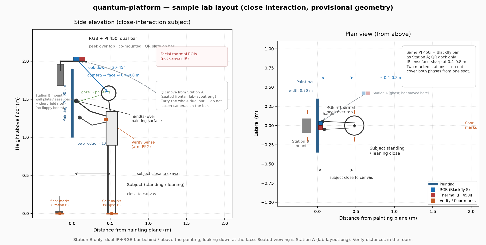

# Study protocol: quantum vs standard painting viewing

| Field | Value |
|-------|--------|
| Document | `docs/PROTOCOL.md` |
| Version | 0.2 |
| Status | **Draft / WIP** |
| Date | 2026-09-24 |
| Authors | TBD |
| Related | [DESIGN.md](DESIGN.md), [HARDWARE.md](HARDWARE.md), [PLAN.md](PLAN.md) |

This is an investigator-facing working draft. It specifies a runnable session once stimuli are defined. It does **not** define what makes a painting “quantum.” Conservative timing and set-size values below are **provisional defaults**, not locked parameters.

---

## 1. Objectives and hypotheses

### 1.1 Primary objective

Record synchronized autonomic, facial, and coarse gaze signals while participants view paintings under two investigator-labeled conditions (`quantum` vs `standard`), using the capture platform in [DESIGN.md](DESIGN.md).

### 1.2 Secondary objectives

- Confirm that the session can be run from an operator checklist with NUC/shutter only outside painting exposure.
- Produce analysis-ready streams keyed by participant, painting ID, and condition.

### 1.3 Hypotheses

> **TBD — hypotheses.** The investigator has not locked specific predictions. Placeholders below are structural only.

| ID | Domain | Placeholder |
|----|--------|-------------|
| H1 | Autonomic | Heart-rate / PPG and facial thermal ROIs differ between `quantum` and `standard` during exposure, relative to a pre-stimulus baseline. |
| H2 | Attention | Coarse gaze AOI occupancy and exploration (e.g. center vs periphery dwell) differ by condition. |
| H3 | Expression | Facial action-unit or blink rates differ by condition. |
| H4 | Behavioral (optional) | If ratings are collected: subjective scores differ by condition and/or track physiology. |

Confirmatory vs exploratory status for each hypothesis is **TBD**.

---

## 2. Participants

### 2.1 Sample size

> **TBD — N and power.** No sample-size justification is locked. A pilot of 2–4 colleagues is assumed before any confirmatory cohort (see [PLAN.md](PLAN.md) Phase 3).

### 2.2 Inclusion (placeholders)

> **TBD — eligibility.** Draft criteria for IRB review; not finalized.

- Age ≥ 18 years (or investigator-specified adult range).
- Able to sit still and view a painting at ~1.5 m, and to stand or lean close to the canvas with hands near or over the painting for the close-interaction segment.
- Normal or corrected-to-normal vision; habitual correction worn during the session.
- Able to provide informed consent.

### 2.3 Exclusion (placeholders)

> **TBD — exclusions.** Confirm medically and ethically with the investigator / IRB.

- Current illness, fever, or facial skin condition that would confound thermal ROIs.
- Known cardiovascular condition or medication that the investigator elects to exclude for HR/PPG interpretability.
- Inability to wear the Polar Verity Sense on the designated arm.
- Prior familiarity with the specific stimulus set if the design requires naive viewing (**TBD**).

### 2.4 Posture (two stations)

**Station A — seated viewing** (`seated_view`):

- Subject sits **upright in a comfortable chair with back support**; feet flat on the floor or on a footrest.
- Chair is **locked / marked on the floor** so viewing distance stays ≈1.5 m (see §4.1.1).
- Seat height adjusted so **eye height ≈ painting center (≈145–150 cm)**.
- During seated exposures: face the painting; minimize talking and large head turns. A chin rest is **not** required unless gaze calibration fails.

**Station B — close interaction** (`close_interact`):

- Subject **stands or leans close to the canvas** with hand(s) near or over the painting surface (see §4.1.2).
- Standing position is **marked on the floor**. Do not wander off the marks during capture.
- Head stays in the look-down FOV; small leans are expected. Hands may briefly occlude the face (see §8.1).

Polar Verity Sense on the **upper arm** for the whole session, clear of chair arms at Station A.

---

## 3. Stimuli: quantum vs standard

### 3.1 Operational definition (not finalized)

> **TBD — operational definition of “quantum paintings” vs “standard paintings.”**
>
> This protocol does not invent a definition. The capture software treats `quantum` and `standard` as **opaque condition tags** on stimulus events (`stimulus_onset` / `stimulus_offset`; see [DESIGN.md](DESIGN.md) §6).
>
> Before any experimental session, the investigator must supply:
> 1. Inclusion rules that partition the stimulus set into the two labeled conditions.
> 2. A written rationale (scientific, not marketing) for that partition.
> 3. A stimulus catalog: unique `painting_id`, condition tag, physical size, medium, and any matching notes.

Until those exist, only dry-run / hardware sessions should be run.

### 3.2 Presentation medium

> **TBD — physical canvas vs screen reproduction.** DESIGN.md allows either. The same medium must be used for both conditions within a session.

| Option | Notes |
|--------|--------|
| Physical canvas (preferred for ecological viewing, if available) | Fixed easel / wall plane; cover or swap only during ISI. Geometry in §4 assumes a 70 × 90 cm example. |
| Screen reproduction | Calibrated display at the same painting-plane distance and visual angle. Color/luminance characterization **TBD**. |

Do not mix physical and screen items inside one participant’s experimental blocks unless the investigator explicitly designs that factor.

### 3.3 Provisional selection criteria

Apply once the definition exists. These are matching rules, not a definition of “quantum.”

| Criterion | Provisional rule |
|-----------|------------------|
| Set size | **TBD.** Provisional default: **8 quantum + 8 standard** unique paintings (16 experimental exposures). |
| Size | Match physical size, or match visual angle if shown on screen. Example geometry uses 70 × 90 cm. |
| Medium | Same support and display method within a session (both canvas or both screen). |
| Matching (as far as practicable) | Luminance range, overall colorfulness, figurative vs abstract class, and approximate visual complexity — **TBD** which of these are hard constraints. |
| Familiarity | Record whether the participant reports knowing the work; whether known works are excluded is **TBD**. |
| Practice items | 1–2 extra paintings **not** in the experimental set, unlabeled or labeled `practice`. |
| Repeats | **TBD.** Provisional default: **no repeat exposures** in the main session. |

### 3.4 Stimulus catalog fields (minimum)

Each item in the catalog should carry:

- `painting_id` (stable string)
- `condition`: `quantum` \| `standard` \| `practice`
- width × height (cm) or display visual angle
- presentation: `physical` \| `screen`
- optional notes for AOIs (see §8.2)

---

## 4. Environment and apparatus

Hardware locked or preferred in [HARDWARE.md](HARDWARE.md) and [DESIGN.md](DESIGN.md). Do not substitute during a session without noting it in `meta.yaml`.

### 4.1 Two camera stations

The session uses **two marked camera geometries**. Do **not** try to cover both phases from one camera spot.

| Tag | Phase | Dual-bar location | Subject |
|-----|-------|-------------------|---------|
| `seated_view` | Seated viewing | Station A — between subject and canvas, tilted up | Locked chair ≈ 1.5 m from painting |
| `close_interact` | Close interaction (last pre-VR capture) | Station B — behind / above the painting, looking down | Standing or leaning close to the canvas |

The same PI 450i + Blackfly pair stays on **one rigid dual bar**. The bar moves between fixed receiver mounts; cameras are not loosened relative to each other (see §4.1.3). Tag every exposure and the session metadata with the active geometry (`seated_view` or `close_interact`; §11).

Facial thermal ROIs remain the target in both geometries (not canvas IR).

#### 4.1.1 Station A — seated viewing (`seated_view`)

For a **70 cm × 90 cm** painting (from prior hardware notes). This figure is the **viewing station only**.



Figure: **Station A / seated viewing only** (provisional; verify in room). Subject sits in a locked chair at ≈1.5 m; seat height set so eye height ≈ painting center (≈145–150 cm). 70×90 cm painting, RGB + PI 450i dual bar on a tripod/pedestal **between** subject and canvas, ≈0.8–1.0 m from the face, tilted up ~12–15°. Verity Sense on the upper arm (clear of chair arms). Close interaction is Station B ([lab-layout-close-interact.png](figures/lab-layout-close-interact.png)).

| Parameter | Baseline | Notes |
|-----------|----------|--------|
| Painting size (example) | 70 × 90 cm | Scale visual-angle notes if size changes. |
| Posture | Seated, fixed chair | Comfortable chair with back support; feet flat or on a footrest. Not standing. |
| Subject-to-painting | ≈ 1.5 m | Chair locked / marked on the floor so this distance stays fixed. ~26° × 33° visual angle at the example size. |
| RGB + IR camera-to-face | ≈ 0.8–1.0 m | Face fills ~30–50% of FOV. |
| Painting center height | ≈ 145–150 cm | Seat height adjusted so **eye height ≈ painting center**. |
| Station A pedestal height | ≈ 95–105 cm | Dual bar tilted up ~12–15°. Floor-marked tripod / pedestal. |
| Thermal + RGB mount | Rigid dual bar + QR plate | See §4.1.3. Never loosen cameras on the bar when changing stations. |
| Chin rest | Not required | Add only if gaze look-at calibration fails. |

Mark the locked chair position (floor marks) and Station A receiver; photograph the locked station once per study site. Confirm chair marks and eye-height alignment before each session.

If paintings are not 70 × 90 cm, keep seated subject-to-painting at 1.5 m unless the investigator rescales for a target visual angle (**TBD**).

#### 4.1.2 Station B — close interaction (`close_interact`)

Last capture segment before the VR break (§5). Subject stands or leans near the canvas with hands over the painting. The same dual bar is docked **behind / above** the painting, peeking over the top edge and looking **down** at the face. Short working distance matches the IR lens chosen for face sharpness.



Figure: **Station B / close interaction only** (provisional; verify in room). 70×90 cm painting; subject standing or leaning close to the canvas with hand(s) near/over the surface. Dual IR+RGB bar on a wall plate or easel-back / stand **behind** the painting, short rigid riser peeking over the top, look-down ≈30–45° toward the face, camera-to-face ≈0.4–0.8 m. Floor marks for the standing position and the Station B mount. Dashed note: the bar moves from Station A via quick-release without loosening cameras. Seated viewing is Station A ([lab-layout.png](figures/lab-layout.png)).

| Parameter | Baseline | Notes |
|-----------|----------|--------|
| Painting size (example) | 70 × 90 cm | Same canvas plane as Station A. |
| Posture | Standing / leaning close | Hands near or over the painting surface. Floor-marked stance. |
| Subject-to-painting | Close (hands at surface) | Not the seated 1.5 m. Exact lean is not locked. |
| RGB + IR camera-to-face | ≈ 0.4–0.8 m | Match the IR lens chosen for face sharpness at this distance. |
| Look-down angle | ≈ 30–45° | Exact angle **TBD** (§13). Prefer station tilt/height over loosening camera-to-bar bolts. |
| Dual-bar location | Behind / above painting | Peek over the top edge; lenses see the face, not the canvas as the thermal target. |
| Station B mount | Wall plate or easel-back + short rigid riser | No floppy boom. Pilot may use a second tripod; prefer a hard mount once the angle is locked. SKU **TBD** (§13). |
| Clearance | Required | Station B must not hit the painting or the subject’s head. |

Hands may briefly occlude the face. Analysis drops those frames (§8.1). Do not treat canvas IR as the measurement target.

#### 4.1.3 Dual-bar mounts and operator move (recommended default)

Keep the Optris PI 450i and Blackfly on **one rigid dual bar**. Never loosen the cameras relative to each other when changing stations — that is what preserves RGB↔thermal calibration.

**Hardware pattern**

- Two **fixed receiver mounts**: Station A (seated frontal, between subject and canvas) and Station B (close look-down, behind / above the painting).
- **Quick-release** interface: one QR plate stays on the dual bar; matched clamps stay on both stations (Arca-Swiss / Manfrotto RC2-style or equivalent). The operator docks the whole bar without tools mid-session.
- Station B may use a short rigid riser so the bar peeks over the canvas top. No floppy boom.
- Pilot sessions may use a second tripod as Station B. Once the look-down angle and height are locked, prefer a wall plate or easel-back hard mount.
- A second spare dual bar (pre-calibrated) is an alternative, not the default (**TBD**, §13).

**Operator move — Station A → Station B**

1. End the seated block / pause at the phase boundary. Do not move hardware during an exposure.
2. NUC only outside exposure (existing policy: ISI, pre-block, or this phase-boundary pause — never during painting exposure).
3. Release QR at Station A; carry the dual bar as **one unit**.
4. Dock into Station B until the QR locks; check there is no play in the clamp or riser.
5. Confirm face framing. Prefer adjusting station tilt/height or the subject’s marked position over loosening camera-to-bar bolts.
6. **Post-move QC.** If the bar stayed rigid, a quick visual RGB–thermal overlay (face still overlaps in both views) may suffice. If the cameras moved relative to each other, or the bar was bumped hard, run a **full RGB–thermal recalibration** before continuing and note it in `meta.yaml`.
7. Log `geometry: close_interact` in `meta.yaml` and on subsequent events (§11).
8. Reverse the same steps to return to Station A (`geometry: seated_view`) if a later seated segment is required.

Cable service loops at both receivers so docking does not yank USB. Confirm Station B clearance against the painting and the subject’s head after docking.

#### 4.1.4 Stability marks

- Floor marks for **both subject positions** (locked chair; standing/leaning close) and **both camera stations** (A pedestal / receiver; B wall plate, easel-back, or stand).
- Photograph each **locked** station once per study site (bar docked, QR seated, cables dressed).
- Recheck marks and QR lock at the start of each session and after every station change.

### 4.2 Room and lighting

- Indoor, quiet, no walk-through traffic during recording.
- Stable ambient lighting. No flickering sources in the RGB FOV; no HVAC blast on the face.
- Avoid sunlight patches that drift across face or canvas.
- Thermal: room temperature noted in session metadata; allow the PI 450i to stabilize per Optris guidance before the first calibration.
- Screen condition (if used): room lights set so the display is the dominant luminance in the painting plane (**TBD** exact lux).

### 4.3 Sensors and placement

| Stream | Device | Placement / notes |
|--------|--------|-------------------|
| Facial IR | Optris PI 450i (owned) | Co-mounted with RGB on the dual bar; face fills thermal FOV at both stations. Manual NUC preferred. Target 80 Hz (or 27 Hz if required). IR lens chosen for face sharpness at the Station B working distance (≈0.4–0.8 m); at Station A the face is farther (≈0.8–1.0 m). |
| Facial RGB | Teledyne FLIR Blackfly S BFS-U3-23S3C-C (recommended; not yet purchased) | Same rigid bar; 60–120 Hz. C-mount lens ~6–8 mm so face is 30–50% of frame at Station A (0.8–1.0 m). At Station B the face fills more of the frame; do not swap the lens mid-session. |
| HR / PPG | Polar Verity Sense (preferred) | **Upper arm**, same arm for the whole session, clear of chair arms. See §9.3. PPG, not ECG R-peaks. |
| Gaze | Derived from face RGB + painting-plane intersection | No dedicated eye tracker in MVP. Coarse AOIs only. |
| Sync | LSL + monotonic timestamps | Timestamp on arrival in each capture thread. |

Optional audio is out of scope for this draft (DESIGN.md: characterize latency separately if added).

---

## 5. Session timeline

Provisional wall-clock total ≈ **45–70 min** for the default 16-trial seated set, including setup. Close-interaction and VR time are **TBD** and sit on top of that. Recalculate if N or ratings change.

| Phase | Content | Provisional duration |
|-------|---------|----------------------|
| 1. Arrival | ID code assigned (not a name in filenames). Consent. Eligibility check. | 5–10 min |
| 2. Sensors | Seat in the locked chair at the Station A floor marks; confirm eye height ≈ painting center. Verity on the designated **upper arm**, clear of chair arms. Dual bar docked at Station A; confirm RGB + thermal FOV and seated face framing. | 5–10 min |
| 3. Calibration | RGB–thermal target; gaze look-at marks on the painting plane; brief Verity signal check. Chin rest only if look-at calibration fails. | 5–10 min |
| 4. Instructions | Sit upright, face the painting; minimize talking and large head turns during seated trials. Explain fixation → painting → pause, then the later close-interaction stand / lean. | 2–3 min |
| 5. Practice | 1–2 practice trials, full trial structure, no experimental items. | ~2 min |
| 6. Experimental blocks (seated) | 16 exposures (provisional) at Station A, `geometry: seated_view`. Optional mid-session break. | ~10–15 min without ratings; longer if ratings added |
| 7. Close interaction | Last capture segment before the VR break. Pause at the phase boundary; move the dual bar Station A → B (§4.1.3). Subject on the standing marks; `geometry: close_interact`. Stimulus set and duration **TBD**. | **TBD** |
| 8. VR break | Follows close-interaction capture. VR content and duration are **TBD** and are not specified in this draft. | **TBD** |
| 9. Debrief | Remove sensors. Questions. Optional familiarity / strategy notes. | 5–10 min |

`session_start` is logged when recording is armed after consent; `session_end` when capture stops after debrief or last trial.

A mid-session break during seated blocks is **TBD**. Provisional default: one optional pause after trial 8, during an extended ISI, with sensors left in place and the dual bar still at Station A.

Close interaction is the **last capture segment before the VR break**. Do not run it from Station A. Timing, trial count, and whether it reuses the experimental catalog are **TBD**.

---

## 6. Trial structure

Each experimental trial is:

**fixation → painting exposure → ISI**

> **TBD — exact durations.** Values below are conservative provisional defaults so the stimulus controller and NUC policy can be implemented. They are not final.

| Epoch | Provisional default | Suggested range | Operator / system notes |
|-------|---------------------|-----------------|-------------------------|
| Fixation | **2.5 s** | 2–3 s | Central mark. Canvas covered, blank plane, or uniform screen. No NUC unless the controller treats fixation as a non-exposure window; prefer NUC in ISI. |
| Painting exposure | **25 s** | 20–30 s | Painting visible. **Never** trigger PI 450i NUC/shutter. No talking, no operator motion in FOV. |
| ISI | **8 s** | 5–10 s | Canvas covered or blank. **NUC/shutter here** (and only here, plus pre-block). Optional rating if enabled. |
| Optional rating | **TBD** (if used: ~8–15 s inside or after ISI) | — | See §8.3. Do not steal time from exposure. |

Provisional trial length without ratings: **2.5 + 25 + 8 = 35.5 s**.  
Provisional 16-trial experimental block: ≈ **9.5 min** plus any break.

### 6.1 What the participant sees

1. **Fixation.** A single central mark on a covered easel, blank board, or blank display at the painting-plane center.
2. **Exposure.** Cover removed or stimulus displayed. Participant faces the painting and views freely, minimizing talking and large head turns.
3. **ISI.** Cover replaced or display blanked. If ratings are on, the rating UI appears here; otherwise rest.

### 6.2 What the operator / controller does

- Emit the event markers in §11 at each epoch boundary.
- Arm a **single** manual NUC at ISI onset (or a fixed offset into ISI, e.g. 0.5 s), never during exposure.
- Swap physical paintings only during ISI (or during a longer inter-block gap).

---

## 7. Conditions, blocks, and randomization

**Design:** within-subjects. Each participant views both conditions.

> **TBD — block structure and randomization.** Provisional default below is intended to limit order and fatigue confounds without requiring a locked stimulus N.

### 7.1 Provisional default

- One experimental sequence of all catalog items (8 `quantum` + 8 `standard`).
- **Interleaved** conditions, constrained so no more than **two consecutive** trials share a condition.
- **First-condition counterbalancing:** odd vs even participant codes start with `quantum` vs `standard` (or a pre-generated list).
- Unique permutation per participant, stored in session metadata before `session_start`.
- Practice trials excluded from randomization of the experimental set.

### 7.2 Alternatives (not default)

| Scheme | Use if |
|--------|--------|
| Two blocked halves (all of one condition, then the other), order counterbalanced | Investigator wants long within-condition runs; higher order/fatigue risk. |
| Latin square over a small fixed catalog | Stimulus N is small and fully locked. |
| Repeat exposures (same painting twice) | Reliability / habituation is a stated aim. **TBD**; not in the default. |

Condition tags on events remain exactly `quantum` or `standard` (plus `practice` if needed) regardless of scheme.

---

## 8. Measures

### 8.1 Continuous (MVP)

All streams share LSL transport and a host monotonic clock. Pair RGB↔thermal by nearest timestamp (DESIGN.md: e.g. ±6.25 ms at 80 Hz thermal). Do not frame-lock cameras of different rates. Measure BLE latency empirically; do not assume a constant.

| Measure | Source | During analysis (provisional) |
|---------|--------|--------------------------------|
| Heart rate / pulse timing | Polar Verity Sense PPG | Window locked to `stimulus_onset` / `stimulus_offset`; baseline from late fixation or pre-block rest (**TBD** exact baseline window). PPG is not ECG R-peaks. |
| Facial temperature ROIs | PI 450i, ROIs mapped from RGB landmarks | Nasal tip / alar, nostrils, inner canthi, periorbita, forehead: mean / std / max °C per frame or epoch. Facial ROIs remain the target at both stations (not canvas IR). |
| Expression / AUs, blinks, micro-motion | Face RGB (MediaPipe or OpenFace, online or offline) | AU time series and blink rate in the exposure window vs baseline. |
| Gaze on painting | RGB iris + head pose → painting-plane intersection (`GazePainting`) | Coarse AOI occupancy and transitions (see §8.2). Not Tobii-grade maps. Expect poorer gaze quality in `close_interact` (lean, hands, look-down). |

**Close-interaction analysis.** The close phase has more occlusion and motion than seated viewing (hands over the painting, leaning). Drop frames where face landmarks fail. Do not interpolate thermal ROIs across those gaps unless the investigator later specifies a rule.

### 8.2 Gaze AOIs

MVP gaze is **coarse** (a few degrees / centimeters on canvas).

**Default session-wide AOIs** (painting plane, relative to canvas bounds):

| AOI | Definition (provisional) |
|-----|--------------------------|
| `center` | Central 50% width × 50% height |
| `left` / `right` | Left or right of vertical midline, excluding `center` if using a five-region split; **TBD** whether regions are exclusive |
| `up` / `down` | Above or below horizontal midline, same caveat |
| `off_canvas` | Gaze ray misses the painting rectangle |

> **TBD — per-painting AOIs.** Content-specific regions (faces, high-contrast loci, “quantum” motifs, etc.) are not defined here. If used, they belong in the stimulus catalog and must remain coarse enough for software gaze.

Per-session look-at calibration (5–9 marks) is required before experimental trials (§9.2).

### 8.3 Optional behavioral ratings

> **TBD — whether ratings are collected, which items, and when.**

If the investigator adds ratings, collect them in ISI or immediately after ISI, never during exposure. Suggested item pool (choose or replace; do not treat as locked):

| Construct | Example item (provisional) |
|-----------|----------------------------|
| Valence | Unpleasant — pleasant (e.g. 7-point) |
| Arousal | Calm — activated |
| Aesthetic | Dislike — like |
| Interest | Not interesting — very interesting |
| Familiarity | Never seen — know well |

Log as optional response events with `painting_id` and condition (see §11).

---

## 9. Calibration procedures

Emit `calibration_start` / `calibration_end` for each procedure (gaze and RGB–thermal may be separate pairs).

### 9.1 RGB–thermal

1. Rigid dual bar already assembled; **do not loosen cameras on the bar** between calibration, seated viewing, and the Station B move.
2. Present a dual-spectrum target at approximately Station A subject distance (0.8–1.0 m): heated / high-emissivity target preferred (~35–40 °C); halogen-lit checkerboard only as a quick alternative ([HARDWARE.md](HARDWARE.md)).
3. Capture paired frames; compute the session homography or stereo mapping (OpenCV `calibrateCamera` / `stereoCalibrate` / planar `findHomography` at fixed distance).
4. Store artifacts under `sessions/<participant_id>/<session_id>/calibration/`.
5. Repeat if the cameras move relative to each other or the bar is bumped hard. A mid-session bump → stop, recalibrate, note in `meta.yaml`.
6. After a clean QR dock (bar stayed rigid), a quick visual RGB–thermal overlap check is enough (§4.1.3 step 6). A full recalibration is required if that check fails or the bar was bumped.

### 9.2 Gaze look-at (painting plane)

1. Place **5–9** marks on or immediately around the canvas (four corners, center, and optionally edge midpoints).
2. For each mark: operator cues “look at this point”; participant fixates ~1–2 s; controller records RGB frames + mark coordinates in painting-plane space.
3. Fit the gaze-ray → plane mapping used for `GazePainting`.
4. QC: after the last mark, re-check 1–2 points; if error is visually large (wrong quadrant), redo. Quantitative error bound is **TBD** (PLAN.md success criterion).

Marks must be removable or outside the artwork so they do not remain during exposure, unless they are on a calibration board that is then replaced by the painting.

### 9.3 Verity Sense

- Fit on the **same upper arm** for the entire session (provisional default: **non-dominant** arm, unless that arm cannot obtain a stable signal).
- Place on the **upper arm**, clear of chair arms so the optical window is not occluded when the participant sits. Record clock position / distance from the elbow in `meta.yaml`.
- Skin clean and dry; band snug, not painful.
- Confirm live HR/PPG in the host UI before practice.
- Do not relocate the band between practice and experimental trials.
- Hardware timestamps and host receive timestamps both stored (DESIGN.md).

---

## 10. Operator checklist

Use as a run sheet. NUC policy is non-negotiable for usable thermal data.

### 10.1 Before the participant arrives

- [ ] Room lights stable; HVAC not blowing on the Station A seat or the Station B standing marks.
- [ ] Station A: chair locked / marked at ≈1.5 m; painting center 145–150 cm; dual bar docked; cameras framed for a seated face.
- [ ] Station B: receiver (wall plate / easel-back / stand) locked; short rigid riser peeking over the canvas top; floor marks for the mount and the standing position; clearance vs painting and head.
- [ ] Both stations: matched QR clamps seated; QR plate on the dual bar; no tools needed to dock. Photograph each locked station (once per site).
- [ ] Cable service loops at both receivers; USB will not yank when the bar is lifted.
- [ ] Confirm chair marks and eye-height alignment (seat height set so eye height ≈ painting center) before the session.
- [ ] PI 450i powered and thermally settled; **manual NUC** mode if supported.
- [ ] RGB + thermal cameras tight **on the bar**; do not loosen them to aim. Calibration target ready.
- [ ] Verity charged; same unit as other sessions if possible.
- [ ] Stimulus order file generated for this participant code.
- [ ] Disk space and session directory created.

### 10.2 Per participant

- [ ] Consent complete; study code only in filenames.
- [ ] Seat in the locked chair on the Station A floor marks; upright, back supported, feet flat or on a footrest.
- [ ] Confirm chair marks and eye-height alignment (eye height ≈ painting center) before starting.
- [ ] Dual bar docked at Station A; QR locked; no play. Log `geometry: seated_view`.
- [ ] Verity on the **same designated upper arm**, clear of chair arms; signal live.
- [ ] RGB–thermal calibration saved.
- [ ] Gaze 5–9-point look-at completed.
- [ ] Practice trials run; participant understands sit facing the painting, minimize talking and large head turns, fixation → view → pause, and the later close-interaction stand / lean.
- [ ] Recording armed (`session_start`).

### 10.3 During trials (critical)

- [ ] **NUC / shutter only in ISI** (or pre-block / extended break). **Never during painting exposure.**
- [ ] Physical swap or cover only in ISI.
- [ ] No operator in the camera FOV during exposure.
- [ ] Same lighting; do not dim/raise lights mid-block.
- [ ] If BLE drops or USB glitches: stop at next ISI, note the trial, resume only if streams recover; otherwise abort and flag the session.
- [ ] Do not move the dual bar during an exposure. Station changes only at a phase boundary (end of seated block → close interaction).

### 10.3.1 Station change (A → B) at the close-interaction boundary

- [ ] Pause at the phase boundary; NUC only outside exposure.
- [ ] Release QR at Station A; carry the dual bar as one unit (cameras stay tight on the bar).
- [ ] Dock at Station B until QR locks; check no play; confirm clearance vs painting and head.
- [ ] Confirm look-down face framing (≈30–45°, ≈0.4–0.8 m). Adjust station tilt/height or the subject’s marks — not camera-to-bar bolts.
- [ ] Post-move QC: visual RGB–thermal overlap if the bar stayed rigid; **full recalibration** if cameras shifted relative to each other or the bar was bumped hard. Document which path was taken.
- [ ] Subject on the Station B standing marks. Log `geometry: close_interact`.
- [ ] Reverse the same steps if returning to Station A.

### 10.4 After the last trial

- [ ] `session_end`; verify `events.jsonl` has paired onset/offset for every exposure, each with `condition` and `geometry`.
- [ ] Confirm no `nuc_trigger` timestamp falls inside any `stimulus_onset`–`stimulus_offset` interval.
- [ ] Confirm station moves have a `geometry_change` (or equivalent note) and that post-move QC / recalibration was logged.
- [ ] Remove Verity; debrief; secure identifiable video per IRB policy (**TBD**, §13).

---

## 11. Data products and event markers

Session layout and marker names follow [DESIGN.md](DESIGN.md) §§5–6.

```
sessions/<participant_id>/<session_id>/
  meta.yaml
  events.jsonl
  calibration/
  streams/
    thermal/
    rgb/
    verity/
    gaze/
  derived/          # optional
```

`meta.yaml` should include at least: protocol version (`0.2`), participant code, operator, **geometry** (`seated_view` and/or `close_interact`, with station notes), chair and standing marks, seat height / eye-height alignment, Station A/B lock photos or a path to them, Verity arm, presentation medium, stimulus order, any post-move QC / recalibration, and any deviations.

### 11.1 Required event markers

| Marker | Payload (minimum) |
|--------|-------------------|
| `session_start` / `session_end` | participant code, session id, active `geometry` if already docked |
| `calibration_start` / `calibration_end` | kind: `rgb_thermal` \| `gaze` |
| `fixation_onset` / `fixation_offset` | trial index |
| `stimulus_onset` / `stimulus_offset` | trial index, `painting_id`, `condition` (`quantum` \| `standard` \| `practice`), **`geometry`** (`seated_view` \| `close_interact`) |
| `isi_onset` / `isi_offset` | trial index |
| `nuc_trigger` | trial index if during ISI; reason (`isi` \| `pre_block` \| `other`) |

### 11.2 Optional markers

| Marker | When |
|--------|------|
| Rating / response events | If §8.3 is enabled; include scale id, value, `painting_id`, condition |
| `break_start` / `break_end` | Mid-session pause |
| Abort / note | Operator comments, dropouts |
| `geometry_change` | Station move: `from` / `to` (`seated_view` \| `close_interact`), whether post-move QC was visual-only or a full RGB–thermal recalibration |

Every painting exposure in the experimental set must have onset **and** offset plus a condition label **and** a geometry tag (`seated_view` or `close_interact`). That is a study-ready success criterion in [PLAN.md](PLAN.md).

---

## 12. Ethics and data handling (engineering notes)

Align with DESIGN.md §8 and IRB once approved.

- Filenames and LSL metadata use study codes, not names.
- Face RGB and thermal are identifiable biometric data. Encryption at rest and retention duration are **TBD** with IRB.
- Do not stream identifiable video off-lab without protocol approval.
- Participants may withdraw; handling of partial sessions is **TBD**.

---

## 13. Open decisions checklist (investigator)

Items the investigator still needs to lock before a confirmatory run. The draft in this document is usable for software and pilot planning without these answers, but experimental conclusions are not.

| # | Decision | Status in this draft |
|---|----------|----------------------|
| 1 | Operational definition of **quantum** vs **standard** paintings, with written inclusion rules | **TBD** — not invented here |
| 2 | Stimulus set size and catalog (`painting_id` list) | **TBD** — provisional default 8 + 8 |
| 3 | Physical canvas vs screen (or a designed mix) | **TBD** — same medium within session |
| 4 | Exact fixation, exposure, and ISI durations | **TBD** — defaults 2.5 / 25 / 8 s |
| 5 | Repeat exposures vs single view | **TBD** — default no repeats |
| 6 | Interleaved vs blocked conditions; randomization constraints | **TBD** — default interleaved, ≤2 consecutive, counterbalanced start |
| 7 | Whether behavioral ratings are collected, which scales, when | **TBD** — optional, ISI only |
| 8 | Per-painting AOIs beyond coarse center / L/R / U/D | **TBD** |
| 9 | Baseline windows for HR and thermal contrasts | **TBD** |
| 10 | Sample size, inclusion/exclusion, caffeine/exercise rules | **TBD**. Chin rest: not required unless gaze calibration fails (see §2.4). |
| 11 | IRB / consent language; video retention; encryption; withdrawal | **TBD** |
| 12 | Quantitative gaze-calibration error bound | **TBD** |
| 13 | Hypotheses confirmatory vs exploratory; primary endpoint | **TBD** |
| 14 | Mid-session break policy | **TBD** — optional after trial 8 (seated; bar stays at Station A) |
| 15 | Purchase confirmation: Blackfly S + lens; Verity Sense kit | Hardware, not protocol, but blocks live RGB |
| 16 | Station B SKU (wall plate vs easel-back vs stand) and exact look-down angle | **TBD** — range ≈30–45°; short rigid riser; no floppy boom |
| 17 | One movable dual bar vs a second spare pre-calibrated bar | **TBD** — default is one bar + QR receivers at A and B |
| 18 | Close-interaction task, duration, and catalog (last pre-VR segment) | **TBD** — geometry `close_interact` is locked; content is not |
| 19 | VR break content and duration | **TBD** — follows close interaction; not specified here |

**Protocol status:** Draft / WIP. Update this table and bump the version header when any row is decided.
